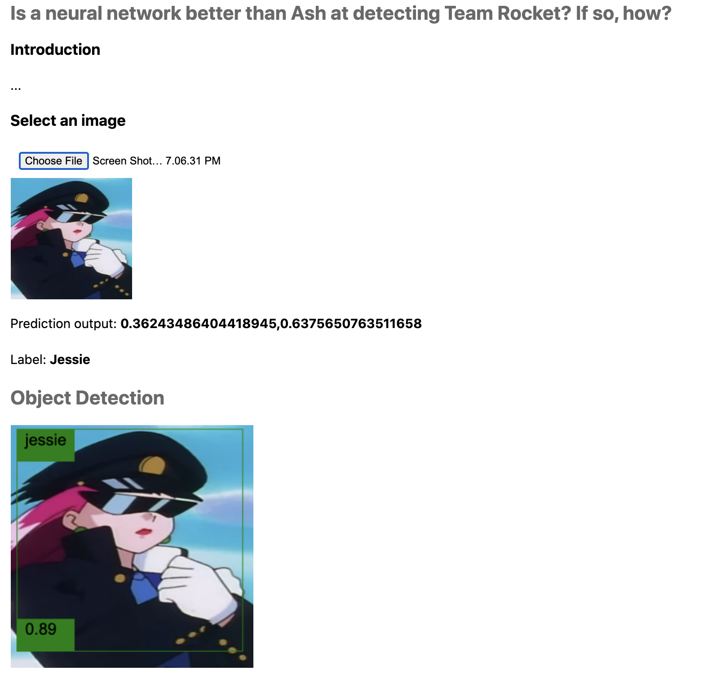
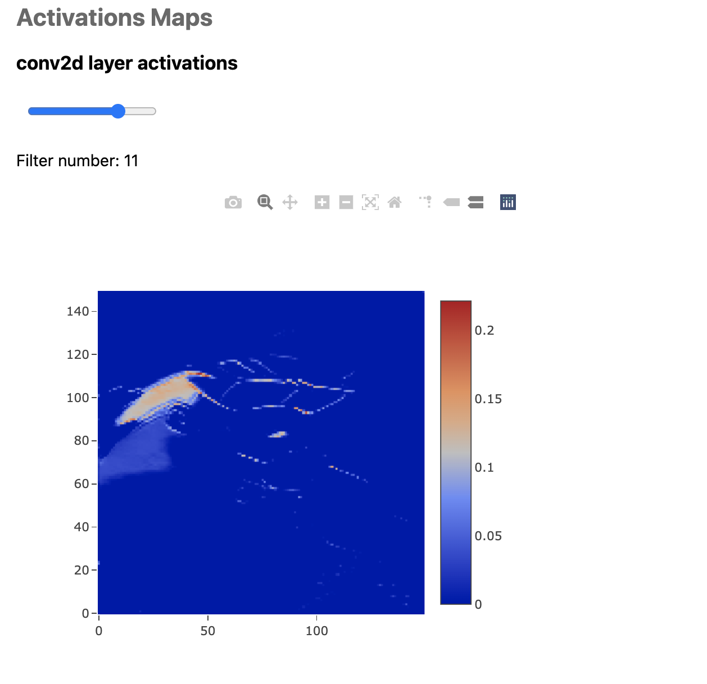

# Is a neural network better than Ash at detecting Team Rocket? If so, how?
### Visualizing activation maps with TensorFlow.js and training CNNs and object detectors from Google Cloud to solve this mystery.

## Introduction
Our whole existence is a never-ending riddle. Are we the only ones in the Universe? What's the point of life? Is a neural network better than Ash at recognizing Team Rocket?  The first two are non-trivial questions that keep many scientists and philosophers up at night. The last one, however, keeps me up at night. In this project, I'll attempt to answer it.

In this repo you will find the web application I built as part of my experiment titled "Is a neural network better than Ash at detecting Team Rocket? If so, how?" The app uses TensorFlow.js to run an object detection model trained in Google Cloud AutoML and an image classifier trained in TensorFlow with the purpose of producing and visualizating the network's activation maps.

## Screenshots
The app looks like this

## The article
You can find the article explaining the project at [Is a neural network better than Ash at detecting Team Rocket? If so, how?](https://juandes.com/neural-network-team-rocket/)

## Running the app
To run the application, you need to host it in a local web server.
I recommend using npm's http-server. To install it, execute the following command `$ npm install http-server -g`.
Then, from the exercise's root directory, run `$ http-server` to start the server. Once running, access the address presented on screen.